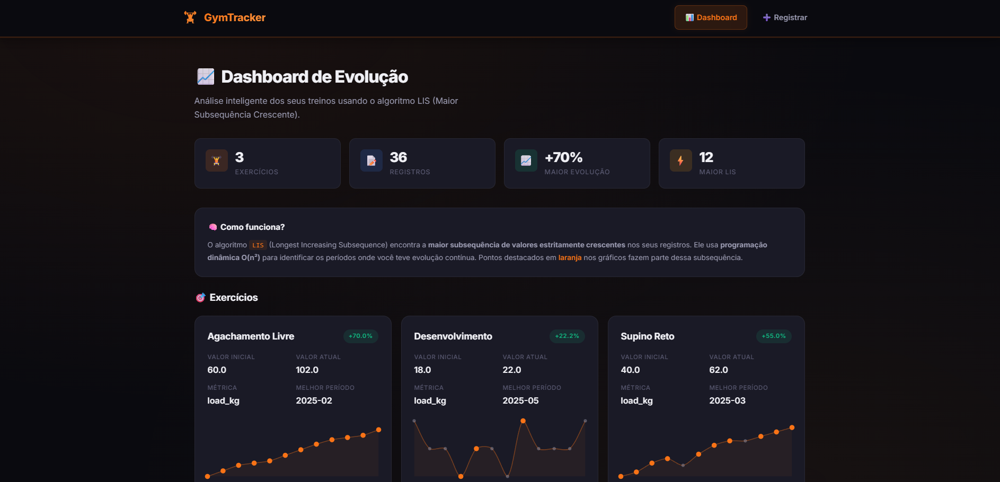
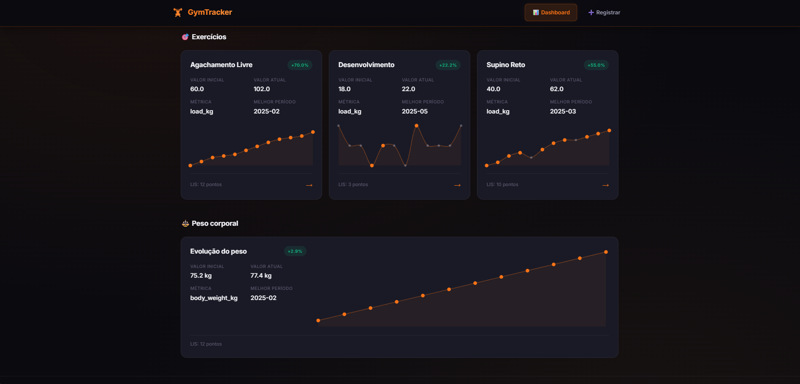
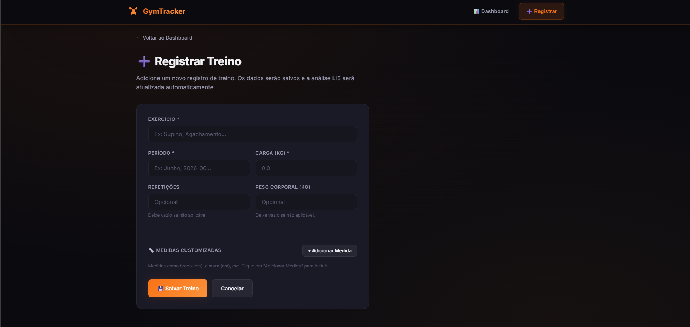
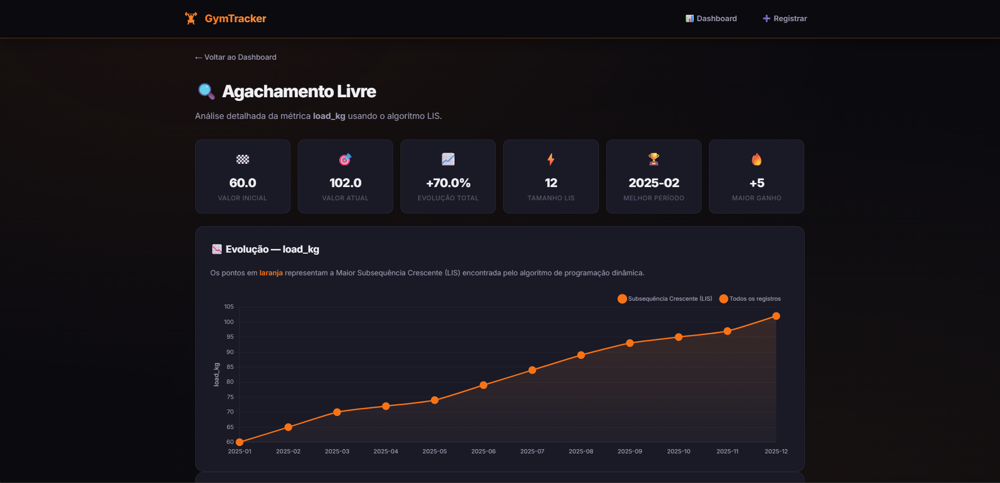
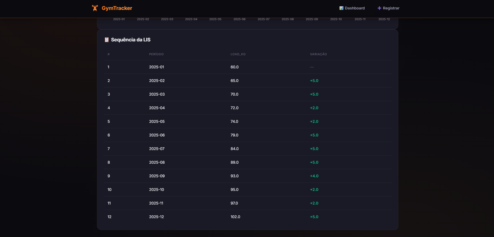

# G25_Programacao_Dinamica_PA-26.1

**Número do trabalho:** 4 <br>
**Conteúdo do Módulo: Programação Dinâmica**

Análise Inteligente de Evolução na Academia

## Alunos

| Matrícula |          Nome Completo           |
| :-------: | :------------------------------: |
| 211062929 | Davi dos Santos Brito Nobre      |
| 221008202 | José Eduardo Vieira do Prado     |

## Sobre o trabalho

Este projeto registra treinos de academia e utiliza o algoritmo da Maior
Subsequencia Crescente (LIS), implementado com programacao dinamica, para
identificar os maiores periodos de evolucao continua em cada exercicio.

A analise pode ser feita para a carga (`load_kg`) ou para outros indicadores
fisicos registrados, como repeticoes (`reps`), peso corporal
(`body_weight_kg`) e medidas customizadas.

### Como usar?

O projeto pode ser executado via terminal (CLI) ou pela interface web.

#### Interface Web (recomendado)

Instalar dependências e iniciar o servidor:

```bash
pip install -r requirements.txt
python3 app.py
```

Acesse [http://localhost:5000](http://localhost:5000) no navegador.

A interface permite:
- 📊 **Dashboard** — Visão geral de todos os exercícios com gráficos
- 🔍 **Análise detalhada** — Clique em um exercício para ver o gráfico da LIS
- ➕ **Registrar treino** — Formulário para adicionar novos registros

#### Terminal (CLI)

Analisar todos os exercicios cadastrados:

```bash
python3 main.py analyze-all
```

Analisar apenas um exercicio:

```bash
python3 main.py analyze --exercise Supino
```

Registrar um novo treino:

```bash
python3 main.py add --exercise Supino --period Junho --load 12 --reps 10
```

Registrar uma medida customizada:

```bash
python3 main.py add --exercise Supino --period Junho --load 12 --measurement braco_cm=34
```

Analisar outro indicador:

```bash
python3 main.py analyze --exercise Supino --metric reps
```

Analisar uma medida customizada:

```bash
python3 main.py analyze --exercise Supino --metric braco_cm
```

Executar os testes:

```bash
python3 -m pytest
```

## Linguagem utilizada

Python 3


## Screenshots (demonstração) 

<div align="center">
  <table>
    <tr>
      <td align="center"><br/>Tela inicial</td>
      <td align="center"><br/>Tela inicial com ZIP</td>
      <td align="center"><br/>Tela de registro de treino</td>
      <td align="center"><br/>Evolução detalhada</td>
      <td align="center"><br/>Sequência LIS</td>      
    </tr>
  </table>
</div>

---


## Vídeo (demonstração)
